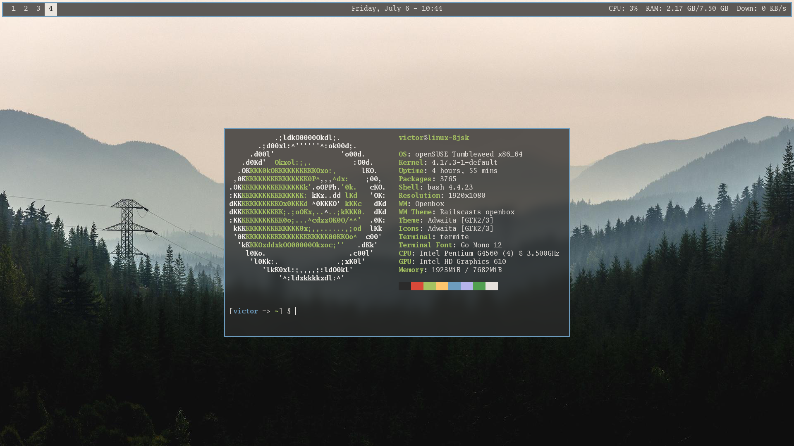

# railscasts setup

This is my railscasts setup.

* Font: Go Mono
* Bar: Polybar
* WM: Openbox
* Terminal: Termite
* Editor: micro
* Compositor: [A fork of compton that allows for dual kawase blur](https://github.com/tryone144/compton)

## Screenshots

## [Wallpaper](https://www.reddit.com/r/wallpapers/comments/49o3g3/washington_1920x1080/)